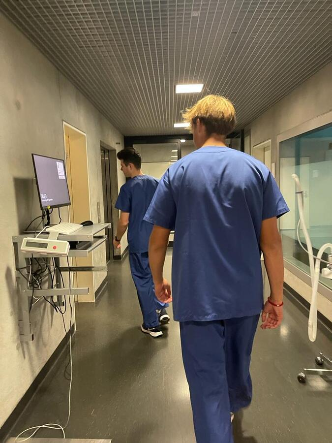

+++
title = "Tierisch gute Behandlung "
date = "2022-12-01"
draft = false
pinned = false
image = ""
+++
# Tierisch gute Behandlung 



Hier werden täglich Tierleben gerettet – Die Kleintierklinik Uni Bern behandelt jedes Jahr rund 6000 Katzen und Hunde. Die Kleintiere werden in der Klinik jeden Tag mit der bestmöglichen medizinischen Versorgung behandelt und operiert. Da die Kleintierklinik an der Universität Bern mehr medizinische Mittel zur Verfügung hat als eine private Tierklinik, kommen viele Tiere von anderen privaten Kliniken. So werden täglich Tiere für komplizierte Operationen von einer privaten Klinik zur Kleintierklinik Universität Bern weitergeleitet. Dadurch dass in der Klinik viele Tiere operiert werden, ist der Alltag für die Angestellten meistens stressig.  

Ein regnerischer Herbstmorgen. Im Bus läuft das Radio. Wir sind auf dem Weg in die Kleintierklinik an der Universität Bern. Pünktlich um acht Uhr morgens stehen wir an der Rezeption. Herzlich werden wir vom Empfangspersonal begrüsst. Nach fünfzehnminütiger Wartezeit werden wir vom Lehrling Gian Althaus begrüsst. Gian begleitet uns anschliessend zum Kleiderschrank, wo wir mit klinischen Kleidern versorgt werden. Als wir schliesslich umgezogen sind, zeigt uns Gian das ganze Gebäude gründlich.  

Im Allgemeinen haben wir einen positiven ersten Eindruck. Das Gebäude ist modern und anschaulich. Dazu hat es zwei Stöcke mit unzähligen Räumen. Das ganze Gelände ist riesig, sodass es schwierig ist, die Übersicht zu behalten. Das Personal besteht mehrheitlich aus Frauen und alles sieht sehr organisiert aus. Jede Person hat etwas zu tun. Auf dem ganzen Gelände sind Angestellte zu sehen. Einige, die sich dort befinden, sind Studierende der Tiermedizin. Anstehende Tierärztinnen und Tierärzte werden in der Kleintierklinik aus- und weitergebildet. Dementsprechend erhalten auch Studentinnen und Studenten eine Ausbildung im Bereich Tiermedizin, damit sie sich auf ihren Beruf vorbereiten können. Ausserdem werden sie von Spezialistinnen und Spezialisten betreut und begleitet. 

 Zum Anfang führt uns Gian zur Abteilung der Radiologie. Dort befinden sich mehrere Röntgengeräte. Zusätzlich zeigt uns eine Angestellte, die in der Abteilung der Radiologie arbeitet, den ganzen Raum und wie alles funktioniert. Wir bleiben nur eine kurze Zeit in dieser Abteilung, da es noch viele weitere Dinge gibt, die wir anschauen können. Nachdem wir ein wenig durch die Klinik gelaufen sind, stehen wir im Zentrum der Klinik. In der Mitte befindet sich ein grosser Monitor, der alle Operationen des heutigen Tages zeigt. Der Tag sieht mit den Terminen schon jetzt voll aus. Dazu kommen noch Tiere aus dem Notfall. 

 Die Notfallaufnahme befindet sich in der Nähe des Haupteingangs, damit das Tier direkt versorgt werden kann. Da ein medizinischer Notfall bei den Tieren rund um die Uhr auftreten kann, muss immer jemand in der Notaufnahme sein, der alles überwacht. Während der Nachtschicht kann es dann schnell einmal kritisch werden, da dann nur wenig Personal zur Verfügung steht. Falls die Pflegeperson allein für vier Tiere in der Nacht gleichzeitig zuständig ist, kann auch was schiefgehen. Bei dieser Notaufnahme werden Hunde und Katzen getrennt behandelt. Dies ist so, da ein Hund oder eine Katze von der Anwesenheit des anderen Tieres gestresst sein können.  

 Bei der Notfallaufnahme angekommen, wird ein Hund behandelt. Der Hund ist von wenigen Minuten in die Klinik eingetroffen. Er hat starke Schmerzen und Fieber. Ausserdem ist der Hund nicht mehr richtig gehfähig. Die Ärztin und das Pflegepersonal nehmen dem Hund mittels eines Venenkatheters Blut ab, damit sie sein Blut überprüfen können. Man vermutet, dass ein Problem mit der Wirbelsäule besteht. Höchstwahrscheinlich handelt es sich um einen Bandscheibenvorfall.

### Nichts für schwache Nerven 

Gegen Mittag in der Tierklinik wird ein Hund an der Leber operiert. Wir sind bereits nach der Ankunft in der Klinik gefragt worden, ob wir bei dieser Operation dabei sein wollen. Deshalb werden wir von der Notaufnahme in die Operationsvorbereitung verlegt. Im Vorbereitungsraum stehen schon einige Leute, die den Hund medikamentös auf die Narkose vorbereiten. Fachleute verstehen unter diesem Vorgang die Prämedikation.  

 Die Prämedikation erfolgt bei dieser Operation mit Propofol. Propofol ist ein Arzneistoff, das dazu führt, dass das Tier lediglich tief schläft. Propofol ist ziemlich gut steuerbar, das heisst, die Wirkung tritt nach wenigen Sekunden ein und ist mit wenigen Risiken verbunden.  

 Der Hund schläft ziemlich schnell ein und die gesamte Stimmung ist recht entspannt. Das Tier wird auf eine Operation vorbereitet, bei dem der Chirurg eine Leberprobe entnimmt, damit das Labor die Leber untersuchen kann. Der Hund schläft mittlerweile und das Personal rasiert den Bauch des Hundes, damit der Chirurg den Bauch ohne Probleme aufschneiden kann. Die letzten Vorbereitungen werden noch getroffen, damit das Tier während der Operation beatmet werden kann. Der Operationssaal befindet sich neben dem Vorbereitungszimmer und der Hund wird sorgfältig in das angrenzende Zimmer transportiert. Der Chirurg und die Chirurgin kommen in den Saal und desinfizieren sich sorgfältig. Der Hund wird zugedeckt und es geht los. Beide sind sehr konzentriert, aber die Stimmung ist lockerer als erwartet. Das Radio läuft und die Chirurgen werden während der OP oft gestört.  

"Die meisten Fehler bei einer Operation entstehen durch die Unachtsamkeit, die die Müdigkeit verursacht”, sagt Franck Forterre, Neurochirurg, Professor für Tiermedizin und Abteilungsleiter der Chirurgie. Auch bei einer Routineoperation kann etwas schief gehen. Chirurgen müssen täglich mehrere Operationen durchführen, die mehrere Stunden dauern können. Dabei werden sie physisch sowie auch psychisch sehr belastet. Nichtsdestotrotz passieren Fehler selten und die allermeisten Operationen verlaufen nach Plan. Aber die Chirurgen machen den Tierbesitzern deutlich klar, dass auch bei einer normalen Operation etwas schiefgehen kann. Weitererzählt Franck Forterre: “Es ist nicht so, dass ich unkonzentriert war. Der Fehler passierte, weil ich zu müde war. Es war Freitagnachmittag und ich wollte die OP gar nicht mehr machen. Ich wollte die am Montag machen, aber ich habe mich überreden lassen und habe sie doch am Freitagnachmittag gemacht und dann ist der Fehler passiert.“ Hier ist der grosse Arbeitsstress unter den Chirurgen deutlich zu sehen.

Der Bauch ist mittlerweile aufgeschnitten und die Chirurgen sind gerade dabei, das Fett zu entfernen, damit sie ein Stück von der Leber abschneiden können. Alles läuft nach Plan und die Operation nähert sich dem Ende. Die Chirurgen nehmen zwei Proben der Leber und sprechen sich mit einem Team der inneren Medizin gut ab. Beide Proben werden noch während der Operation von einer Forscherin abgeholt. Der Verdacht besteht, dass sich Parasiten in der Leber befinden. Die Chirurgen müssen nur noch die offene Stelle am Bauch zunähen und schon kann der Hund auf die Aufwachstation, wo er sich nach der Operation erholen wird.  Die Operation nach mehr als einer Stunde abgeschlossen. 

Die Aufwachphase ist ebenfalls ein wichtiger Prozess der Operation. Das Tier muss gut überwacht werden, da sich das Tier in der Aufwachstation wieder sammelt und weiter mit Medikamenten versorgt wird. Ab und zu befindet sich in dieser Station eine Sauerstoffbox, in der das Tier mit ausreichend Wärme und Sauerstoff versorgt wird, damit die Wunden besser heilen.