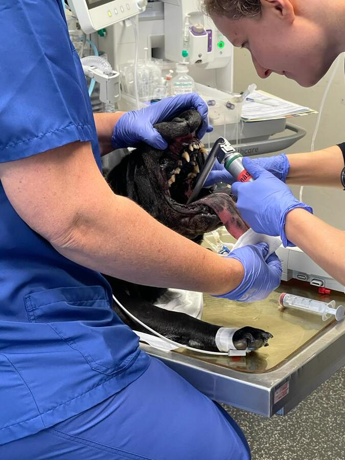

+++
title = "Tierisch gute Behandlung "
date = "2022-12-02"
draft = false
pinned = false
tags = ["Reportage"]
image = "r3.jpg"
+++
# Tierisch gute Behandlung 



Wie läuft eine Hundeoperation? Wie kommt es zur Einschläferung? Wir lernen die Kleintierklinik an der Universität Bern kennen und erleben eine Operation hautnah.  



Hier werden täglich Tierleben gerettet – Die Kleintierklinik Uni Bern behandelt jedes Jahr rund 6000 Katzen und Hunde. Die Kleintiere werden in der Klinik jeden Tag mit der bestmöglichen medizinischen Versorgung behandelt und operiert. Da die Kleintierklinik an der Universität Bern mehr medizinische Mittel zur Verfügung hat als eine private Tierklinik, kommen viele Tiere von anderen privaten Kliniken. So werden täglich Tiere für komplizierte Operationen von einer privaten Klinik zur Kleintierklinik Universität Bern weitergeleitet. Dadurch dass in der Klinik viele Tiere operiert werden, ist der Alltag für die Angestellten meistens stressig.  



Die Kleintierklinik der Vetsuisse Fakultät Bern ist ein Tierspital für kleine Haustiere.  Die Klinik ist auf neuestem technischem Stand und behandelt die Tiere mit der bestmöglichen medizinischen Versorgung. Zudem werden in diesem Tierspital verschiedenste tierische Krankheiten untersucht und allenfalls mögliche Behandlungen entwickelt. Junge anstehende Tierärztinnen und Tierärzte werden in diesem Spital aus- und weitergebildet. Dementsprechend werden sie von den Tierärzten betreut und begleitet. 



Ein regnerischer Herbstmorgen. Im Bus läuft das Radio. Wir sind auf dem Weg in die Kleintierklinik an der Universität Bern. Pünktlich um acht Uhr morgens stehen wir an der Rezeption. Herzlich werden wir vom Empfangspersonal begrüsst. Nach fünfzehnminütiger Wartezeit werden wir vom Lehrling Gian Althaus begrüsst. Gian begleitet uns anschliessend zum Kleiderschrank, wo wir mit klinischen Kleidern versorgt werden. Als wir schliesslich umgezogen sind, zeigt uns Gian das ganze Gebäude gründlich.  

Im Allgemeinen haben wir einen positiven ersten Eindruck. Das Gebäude ist modern und anschaulich. Dazu hat es zwei Stöcke mit unzähligen Räumen. Das ganze Gelände ist riesig, sodass es schwierig ist, die Übersicht zu behalten. Das Personal besteht mehrheitlich aus Frauen und alles sieht sehr organisiert aus. Jede Person hat etwas zu tun. Auf dem ganzen Gelände sind Angestellte zu sehen. Einige, die sich dort befinden, sind Studierende der Tiermedizin. Anstehende Tierärztinnen und Tierärzte werden in der Kleintierklinik aus- und weitergebildet. Dementsprechend erhalten auch Studentinnen und Studenten eine Ausbildung im Bereich Tiermedizin, damit sie sich auf ihren Beruf vorbereiten können. Ausserdem werden sie von Spezialistinnen und Spezialisten betreut und begleitet. 

 Zum Anfang führt uns Gian zur Abteilung der Radiologie. Dort befinden sich mehrere Röntgengeräte. Zusätzlich zeigt uns eine Angestellte, die in der Abteilung der Radiologie arbeitet, den ganzen Raum und wie alles funktioniert. Wir bleiben nur eine kurze Zeit in dieser Abteilung, da es noch viele weitere Dinge gibt, die wir anschauen können. Nachdem wir ein wenig durch die Klinik gelaufen sind, stehen wir im Zentrum der Klinik. In der Mitte befindet sich ein grosser Monitor, der alle Operationen des heutigen Tages zeigt. Der Tag sieht mit den Terminen schon jetzt voll aus. Dazu kommen noch Tiere aus dem Notfall. 

Die Notfallaufnahme befindet sich in der Nähe des Haupteingangs, damit das Tier direkt versorgt werden kann. Da ein medizinischer Notfall bei den Tieren rund um die Uhr auftreten kann, muss immer jemand in der Notaufnahme sein, der alles überwacht. Während der Nachtschicht kann es dann schnell einmal kritisch werden, da dann nur wenig Personal zur Verfügung steht. Falls die Pflegeperson allein für vier Tiere in der Nacht gleichzeitig zuständig ist, kann auch was schiefgehen. Bei dieser Notaufnahme werden Hunde und Katzen getrennt behandelt. Dies ist so, da ein Hund oder eine Katze von der Anwesenheit des anderen Tieres gestresst sein können.  

Bei der Notfallaufnahme angekommen, wird ein Hund behandelt. Der Hund ist von wenigen Minuten in die Klinik eingetroffen. Er hat starke Schmerzen und Fieber. Ausserdem ist der Hund nicht mehr richtig gehfähig. Die Ärztin und das Pflegepersonal nehmen dem Hund mittels eines Venenkatheters Blut ab, damit sie sein Blut überprüfen können. Man vermutet, dass ein Problem mit der Wirbelsäule besteht. Höchstwahrscheinlich handelt es sich um einen Bandscheibenvorfall.

> “Die meisten Fehler bei einer Operation entstehen durch Unachtsamkeit.”  
>
> Franck Forterre, Neurochirurg 

### Nichts für schwache Nerven 

Gegen Mittag in der Tierklinik wird ein Hund an der Leber operiert. Wir sind bereits nach der Ankunft in der Klinik gefragt worden, ob wir bei dieser Operation dabei sein wollen. Deshalb werden wir von der Notaufnahme in die Operationsvorbereitung verlegt. Im Vorbereitungsraum stehen schon einige Leute, die den Hund medikamentös auf die Narkose vorbereiten. Fachleute verstehen unter diesem Vorgang die Prämedikation.  

Die Prämedikation erfolgt bei dieser Operation mit Propofol. Propofol ist ein Arzneistoff, das dazu führt, dass das Tier lediglich tief schläft. Propofol ist ziemlich gut steuerbar, das heisst, die Wirkung tritt nach wenigen Sekunden ein und ist mit wenigen Risiken verbunden.  

Der Hund schläft ziemlich schnell ein und die gesamte Stimmung ist recht entspannt. Das Tier wird auf eine Operation vorbereitet, bei dem der Chirurg eine Leberprobe entnimmt, damit das Labor die Leber untersuchen kann. Der Hund schläft mittlerweile und das Personal rasiert den Bauch des Hundes, damit der Chirurg den Bauch ohne Probleme aufschneiden kann. Die letzten Vorbereitungen werden noch getroffen, damit das Tier während der Operation beatmet werden kann. Der Operationssaal befindet sich neben dem Vorbereitungszimmer und der Hund wird sorgfältig in das angrenzende Zimmer transportiert. Der Chirurg und die Chirurgin kommen in den Saal und desinfizieren sich sorgfältig. Der Hund wird zugedeckt und es geht los. Beide sind sehr konzentriert, aber die Stimmung ist lockerer als erwartet. Das Radio läuft und die Chirurgen werden während der OP oft gestört.  

"Die meisten Fehler bei einer Operation entstehen durch die Unachtsamkeit, die die Müdigkeit verursacht”, sagt Franck Forterre, Neurochirurg, Professor für Tiermedizin und Abteilungsleiter der Chirurgie. Auch bei einer Routineoperation kann etwas schief gehen. Chirurgen müssen täglich mehrere Operationen durchführen, die mehrere Stunden dauern können. Dabei werden sie physisch sowie auch psychisch sehr belastet. Nichtsdestotrotz passieren Fehler selten und die allermeisten Operationen verlaufen nach Plan. Aber die Chirurgen machen den Tierbesitzern deutlich klar, dass auch bei einer normalen Operation etwas schiefgehen kann. Weitererzählt Franck Forterre: “Es ist nicht so, dass ich unkonzentriert war. Der Fehler passierte, weil ich zu müde war. Es war Freitagnachmittag und ich wollte die OP gar nicht mehr machen. Ich wollte die am Montag machen, aber ich habe mich überreden lassen und habe sie doch am Freitagnachmittag gemacht und dann ist der Fehler passiert.“ Hier ist der grosse Arbeitsstress unter den Chirurgen deutlich zu sehen.



Prof. Dr. med. vet. Franck Forterre ist ein französischer Kleintierchirurg spezialisiert auf Neurochirurgie. Er arbeitet seit 2014 in der Kleintierklinik der Universität Bern und leitet die Abteilung der Chirurgie. Er studierte Tiermedizin an der Universität Toulouse. « In Frankreich gehört die Tiermedizin zu den Fächern der Hochschulen. Meine Eltern wollten, dass ich an einer Hochschule studiere, also studierte ich Tiermedizin als Kompromiss mit meinen Eltern», sagt Franck Forterre



Der Bauch ist mittlerweile aufgeschnitten und die Chirurgen sind gerade dabei, das Fett zu entfernen, damit sie ein Stück von der Leber abschneiden können. Alles läuft nach Plan und die Operation nähert sich dem Ende. Die Chirurgen nehmen zwei Proben der Leber und sprechen sich mit einem Team der inneren Medizin gut ab. Beide Proben werden noch während der Operation von einer Forscherin abgeholt. Der Verdacht besteht, dass sich Parasiten in der Leber befinden. Die Chirurgen müssen nur noch die offene Stelle am Bauch zunähen und schon kann der Hund auf die Aufwachstation, wo er sich nach der Operation erholen wird.  Die Operation nach mehr als einer Stunde abgeschlossen. 

Die Aufwachphase ist ebenfalls ein wichtiger Prozess der Operation. Das Tier muss gut überwacht werden, da sich das Tier in der Aufwachstation wieder sammelt und weiter mit Medikamenten versorgt wird. Ab und zu befindet sich in dieser Station eine Sauerstoffbox, in der das Tier mit ausreichend Wärme und Sauerstoff versorgt wird, damit die Wunden besser heilen.  

> “In der Tiermedizin ist es so, dass immer ein Besitzer hinter dem Tier steht.” 
>
> Franck Forterre, Neurochirurg 

### Traurige Erlösung 

Die Euthanasie oder auch Einschläferung ist ein trauriges, aber essenzielles Thema. An der Tierklinik Uni Bern wird etwa jeden zweiten Tag ein Tier eingeschläfert. In der Kleintierklinik wird ein wenig anders eingeschläfert als in privaten Kliniken. Dem Tier werden zwei Medikamente beim Einschläfern gegeben. Das erste bewirkt, dass das Tier schläft und nichts mitbekommt. Das zweite bewirkt, dass das Herz vom Tier langsam aufhört zu schlagen. Tiere auf diese Art einzuschläfern, kosten ein wenig mehr Geld, als ohne Schlafmedikament einzuschläfern. Diese Methode ist aber angenehmer für das Tier.  

Die Einschläferung kann unterschiedliche Gründe haben. An der Kleintierklinik wird nur ein Tier eingeschläfert, wenn es schwer erkrankt ist und der Zustand des Tieres sich von Tag zu Tag verschlechtert, sodass das Tier unaushaltbare Schmerzen erleiden muss. Zudem muss es keine medizinische Hilfe oder Möglichkeit geben, damit es dem Tier besser geht. “In der Tiermedizin ist es so, dass immer ein Besitzer hinter dem Tier steht”, sagt Franck Forterre zur Einschläferung. Die Besitzer werden zuerst informiert und die Entscheidung liegt schlussendlich beim Besitzer.  

### Gefährlich nah 

Mittlerweile ist es schon Nachmittag und wir kommen von der Mittagspause zurück. Wir können bei einer zweiten Operation dabei sein. Dieses Mal ist es eine Katze, die operiert wird. Die Katze hat eine Entzündung am Kiefer (Lymphknoten). Als wir den Raum betreten, ist der Chirurg schon am Operieren. Bei dieser Operation sind ebenfalls viele Leute anwesend, die zuschauen oder mithelfen. Die Katzen-Operation verläuft lange Zeit reibungslos. Plötzlich bewegt sich die Katze während der Operation.  

 Für alle ist das kurz ein Stressmoment, aber dass sich ein Tier während der Operation ein wenig bewegt, ist keine Seltenheit. Die Ärztin muss der Katze lediglich mehr Propofol geben, sodass die Katze sich nicht mehr bewegt. Die Stimmung ist wie während der ersten Operation recht locker. Das Fachpersonal ist offen und erklärt uns wieder, was die Ursachen für die Behandlung ist. Zudem befinden sich drei Studentinnen im Raum, die uns weitere Informationen zur Operation geben. Der Chirurg bittet uns sogar um Hilfe. Wir sollen ihm helfen, den Lymphknoten in ein Glas zu tun, was wir natürlich machen. Die Operation ist schnell vorbei und der Chirurg hat es ziemlich eilig. Er hat nur wenig Zeit, um etwas zu essen, da schon bald die nächste Operation ansteht.  

Nach der Operation ist der Tag in der Klinik für uns zu Ende und wir ziehen uns wieder um. Wir bedanken uns bei allen in der Klinik. Der Tag geht zu Ende und es ist langsam dunkel geworden. Wir fahren wieder mit dem Bus nach Hause. Schneller als gedacht geht ein aufregender und informativer Tag in der Kleintierklinik an der Universität Bern zu Ende. Wir haben viele Eindrücke sammeln und einen gute in den Beruf eines Tierarztes blicken können.